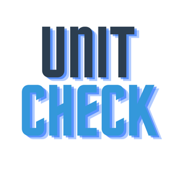
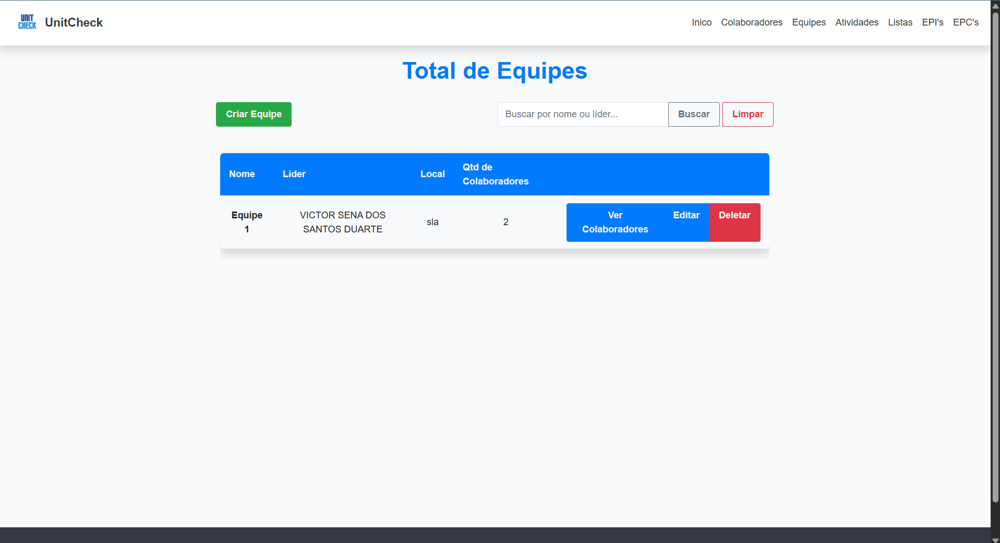
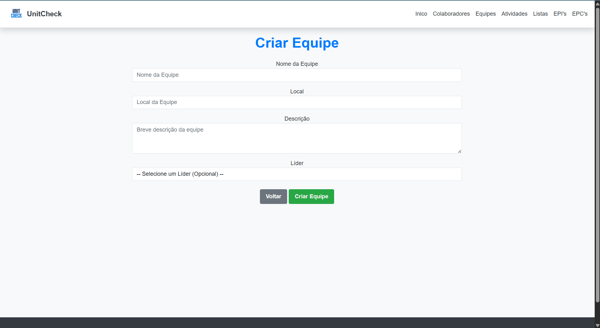
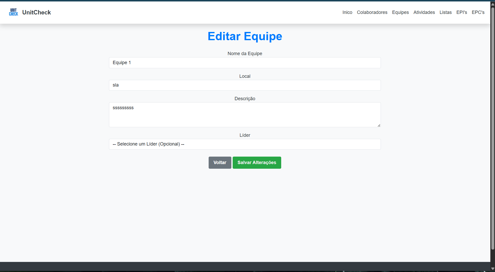
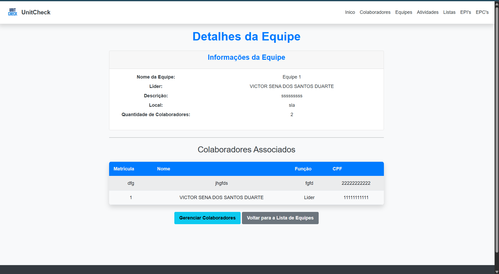
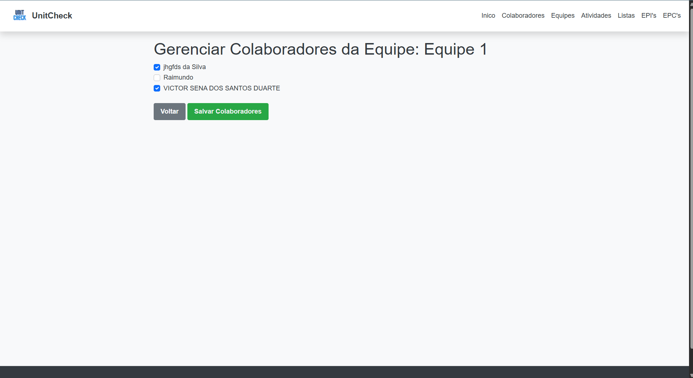
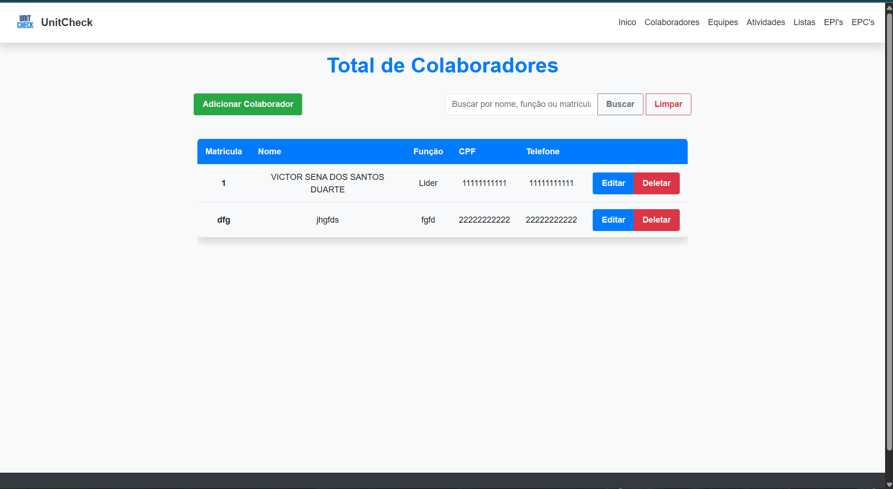
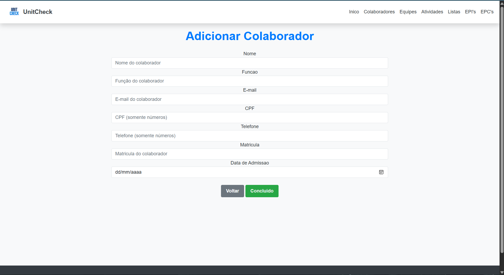
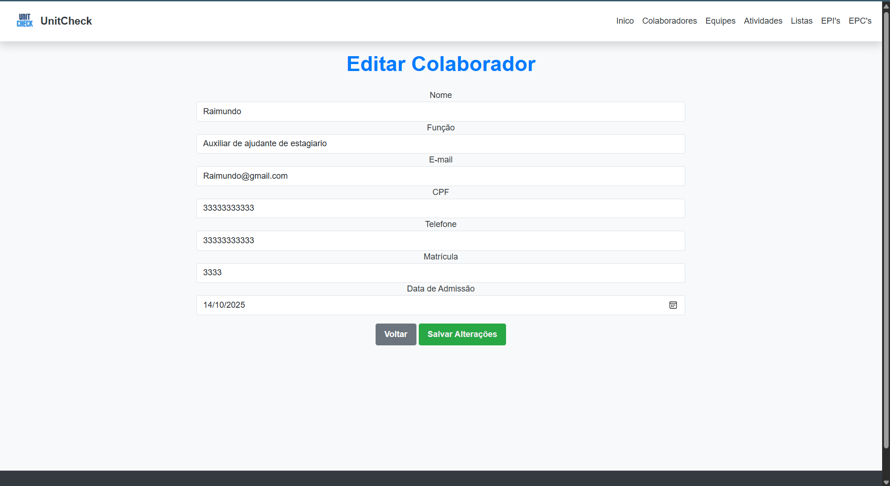

# Projeto UnitCheck: Gerenciamento de Equipes e Colaboradores

---


## Apresentação

**O Desafio**

Em ambientes corporativos dinâmicos, a eficiência na gestão de talentos e a alocação de recursos são cruciais. Muitas vezes, a falta de uma visão clara sobre a composição das equipes e as responsabilidades dos colaboradores gera gargalos, duplicidade de esforços e dificuldades no planejamento de projetos.

**O Propósito do UnitCheck**

O UnitCheck nasce como uma solução web robusta para centralizar e simplificar o gerenciamento de recursos humanos (RH) e de projetos. Seu propósito principal é fornecer uma plataforma onde líderes e gestores possam rapidamente organizar, visualizar e modificar a estrutura de suas equipes, garantindo que cada colaborador esteja alocado corretamente e que as informações de contato e liderança estejam sempre atualizadas. É uma ferramenta essencial para a manutenção da organização interna e para o suporte à tomada de decisão estratégica.

## 📄 Descrição do Projeto

Este projeto é uma aplicação web desenvolvida em **ASP.NET Core MVC** que simula um sistema de gerenciamento de equipes e seus colaboradores. Ele permite realizar operações CRUD (Create, Read, Update, Delete) completas para **Equipes** e **Colaboradores**, além de gerenciar a associação de colaboradores a equipes.

## 📄 Arquitetura e Estrutura:

O projeto segue o padrão Model-View-Controller (MVC), promovendo a separação de responsabilidades. A persistência de dados é gerenciada pelo Entity Framework Core 8.0, atuando como um ORM (Object-Relational Mapper), o que garante a robustez e portabilidade da aplicação.

### Funcionalidades Principais:

* **Gerenciamento de Equipes:**
    * Visualização Total: Acesso a uma lista completa de todas as equipes cadastradas.
    

    * Criação Flexível: Cadastro de novas equipes, com opção para atribuição imediata de um líder.
    

    * Controle de Dados: Edição de informações da equipe (Nome, Local, Descrição e Líder).
    

    * Detalhes Completos: Visualização da ficha detalhada de uma equipe, incluindo todos os colaboradores a ela associados.
    

    * Gestão de Colaboradores na Equipe: Interface intuitiva com checkboxes para adicionar e remover colaboradores de uma equipe específica.
    

* **Gerenciamento de Colaboradores:**

    * CRUD completo para a entidade Colaborador (Visualizar, Criar, Editar e Excluir).
    
    
    


---

## 🛠️ Recursos e Tecnologias Utilizadas

A escolha das tecnologias foca em performance, segurança e manutenção.

* **Backend:**
    * **ASP.NET Core 8.0 MVC:** Framework moderno da Microsoft, focado em alta performance e escalabilidade.
    * **Entity Framework Core 8.0:** Simplifica a interação com o banco de dados e abstrai o código SQL, tornando-o mais limpo e seguro.
    * **C#:** Linguagem robusta e orientada a objetos, ideal para sistemas de gestão.
* **Frontend:**
    * **HTML5, CSS3, JavaScript:** Base para as páginas web.
    * **Bootstrap 5:** Garante um design responsivo e moderno, facilitando o desenvolvimento de uma interface agradável e funcional.
    * **Razor Views:** Engine de templates do ASP.NET Core, permite a renderização dinâmica de conteúdo HTML com código C#.
* **Banco de Dados:**
    * **MySQL:** Um sistema de gerenciamento de banco de dados relacional (SGBDR) popular e de código aberto, ideal para armazenar os dados do sistema.

---

## Roadmap: Planejamento Futuro

O projeto está planejado em fases para garantir um desenvolvimento progressivo e a entrega de valor contínua. As próximas etapas incluem o desenvolvimento de recursos tanto para a Versão para PC quanto para a Versão Mobile.

**Fase 1: Mínimo Viável (MVP):** 1. CRUD de Equipes **Status:** Concluído

**Fase 1: Mínimo Viável (MVP):** 2. CRUD de Colaboradores **Status:** Concluído

**Fase 1: Mínimo Viável (MVP):** 3. Gerenciamento de Associações Equipe-Colaborador (Checkboxes) **Status:** Concluído

**Fase 2: Expansão - Versão PC:** 4. Cadastro e Login de Usuário: Criar funcionalidade de usuário e registro no banco de dados. **Status:** Planejado

**Fase 2: Expansão - Versão PC:** 5. Geração e Categorização de Listas de Presença: Implementar o modelo digital de listas de presença e categorizar tipos de lista (DDS, treinamentos, reuniões). **Status:** Planejado

**Fase 3: Novas Funcionalidades - PC:** 6. Relatórios, Câmera e Dashboard: Implementar a geração de relatórios de atividades, integrar câmera/dispositivo para captura e criar um dashboard com métricas (presença, produtividade, KPIs). **Status:** Planejado

**Fase 3: Novas Funcionalidades - PC:** 7. Funcionalidade Offline: Criar cache local e sincronização para permitir o funcionamento offline. **Status:** Planejado

**Fase 4: Integração Mobile:** 8. Integração Básica Mobile: Criar funções para login de usuário e visualização de equipes no ambiente mobile. **Status:** Planejado

**Fase 4: Integração Mobile:** 9. Registro de Presença Mobile: Criar função para listar presenças com colaboradores da equipe. **Status:** Planejado

---

## Controle de Versão

O controle de versão do projeto é gerenciado através do Git, com o repositório hospedado na plataforma GitHub.

**Estratégia de Branches**

Considerando a fase atual de desenvolvimento do UnitCheck, que se caracteriza por ser um projeto com escopo inicial e gerenciado por um time enxuto, adotamos uma estratégia de branching simplificada:

Branch Principal (main): Atualmente, toda a atividade de desenvolvimento e as releases estáveis são concentradas nesta branch.

Justificativa: Esta abordagem otimiza o fluxo de trabalho para projetos de complexidade moderada, reduzindo a sobrecarga de gerenciamento de múltiplos ambientes de código (como develop e main).

Evolução Futura: À medida que o projeto ganhar funcionalidades adicionais, aumentar a complexidade técnica ou envolver um número maior de contribuidores, será migrado para um fluxo de trabalho mais robusto, como o Git Flow simplificado, que incluirá branches de desenvolvimento (develop) e de funcionalidades (feature/).


---

## 🚀 Como Executar o Projeto

Siga os passos abaixo para configurar e rodar o projeto em sua máquina local.

### Pré-requisitos

Certifique-se de ter os seguintes softwares instalados:

* [.NET SDK 8.0](https://dotnet.microsoft.com/download/dotnet/8.0) ou superior.
* [Visual Studio 2022](https://visualstudio.microsoft.com/vs/community/) (Recomendado) ou outro editor de código compatível (ex: VS Code).
* Um servidor de banco de dados **MySQL** configurado e em execução (ou outro SGBDR como SQL Server, desde que a connection string seja ajustada).

### Configuração do Banco de Dados

1.  **String de Conexão:**
    * Abra o arquivo `appsettings.json` na raiz do projeto.
    * Localize a seção `ConnectionStrings` e atualize a string de conexão com os dados do seu servidor MySQL (ou SQL Server).

    ```json
    "ConnectionStrings": {
      "DefaultConnection": "Server=localhost;Port=3306;Database=UnitCheckDB;Uid=seu_usuario;Pwd=sua_senha;" // Exemplo MySQL
      // Ou para SQL Server: "DefaultConnection": "Server=localhost\\SQLEXPRESS;Database=UnitCheckDB;Trusted_Connection=True;MultipleActiveResultSets=true;"
    }
    ```
    * **Importante:** Substitua `seu_usuario`, `sua_senha` e `UnitCheckDB` (se você usou outro nome para o banco) pelos seus próprios dados.

2.  **Executar Migrações:**
    * Abra o **Terminal** ou **Prompt de Comando** na pasta raiz do projeto (`UnitCheck` onde está o `UnitCheck.csproj`).
    * Execute os seguintes comandos para aplicar as migrações e criar/atualizar o banco de dados:

    ```bash
    dotnet ef database update
    ```
    * Dica de Solução de Problemas: Se for a primeira vez ou tiver problemas, você pode tentar:
        ```bash
        dotnet ef migrations remove # Se houver migrações incompletas/problemas
        dotnet ef migrations add InitialCreate # Ou o nome da sua primeira migração
        dotnet ef database update
        ```

### Rodando a Aplicação

    * Na pasta raiz do projeto, execute:
        ```bash
        dotnet run
        ```
    * O console indicará o endereço (URL) onde a aplicação está rodando (geralmente `https://localhost:xxxx` ou `http://localhost:xxxx`).

---

## 🤝 Contribuições

Sinta-se à vontade para contribuir com este projeto. Para isso, faça um fork do repositório, crie uma nova branch, faça suas alterações e envie um Pull Request.

---

## 📧 Contato

Se tiver alguma dúvida ou sugestão, entre em contato:

* [Victor Sena Dos Santos Duarte]
* [victorsena338@gmail.com]

---